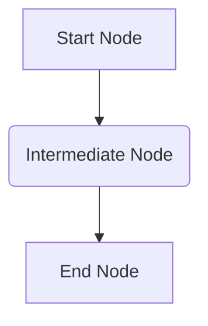

# Workflow & Node Definition

A workflow is the blueprint for an execution. It's a declarative JSON structure that defines the tasks (Nodes) and the connections between them (Edges).

## WorkflowDefinition

This is the main object that you provide to the `WorkflowEngine`. It consists of two key parts:

-   `nodes`: An array of `Node` objects.
-   `edges`: An array of `Edge` objects that connect the nodes.

```typescript
const workflowDefinition: WorkflowDefinition = {
  nodes: [
    { id: "n1", type: "my-custom-node", data: { message: "Hello" } },
    { id: "n2", type: "another-node", data: { value: 123 } }
  ],
  edges: [
    { id: "e1", source: "n1", target: "n2" }
  ]
};
```

Here's a visual representation of a simple workflow:



### Node

A `Node` is a single unit of work in your workflow. It has:
- `id`: A unique identifier for the node within the workflow.
- `type`: A string that maps to a `NodeDefinition`.
- `data`: A JSON object containing the static configuration for this node instance. This data can be made dynamic using [expressions](./expressions.md).

### Edge

An `Edge` defines the flow of execution between nodes. It has:
- `id`: A unique identifier for the edge.
- `source`: The ID of the node where the edge originates.
- `target`: The ID of the node where the edge terminates.
- `sourceHandle` (optional): A key for implementing conditional logic. For more details, see the [Conditionals guide](../guides/conditionals.md).

## NodeDefinition

While `WorkflowDefinition` describes the structure, `NodeDefinition` describes the behavior. It's a JavaScript object that tells the engine how a certain `type` of node should operate.

You provide an object containing all your `NodeDefinition`s when you instantiate the `WorkflowEngine`. A schema definition library compatible with **Standard Schema** (like Valibot or Zod) should be used.

```typescript
import { object, string, parse } from "valibot"; // Using valibot syntax

const nodeDefinitions = {
  "my-custom-node": {
    // Schema for input validation
    input: object({ message: string() }),
    // Schema for output validation
    output: object({ status: string() }),
    // The execution logic
    executor: async (data) => {
      // The 'data' type is inferred from the 'input' schema
      console.log(data.message); // "Hello"
      return { data: { status: "ok" } };
    }
  },
  // ... other node definitions
};
```

A `NodeDefinition` contains:
- `input`: A Standard Schema to validate the node's resolved input data.
- `output`: A Standard Schema to validate the data returned by the executor.
- `retryPolicy`: An optional policy for [error handling](../guides/error-handling.md).
- `executor`: An `async` function that contains the node's business logic. It receives the resolved `data` and the full `context`, and must return an object containing the `data` to be passed on.