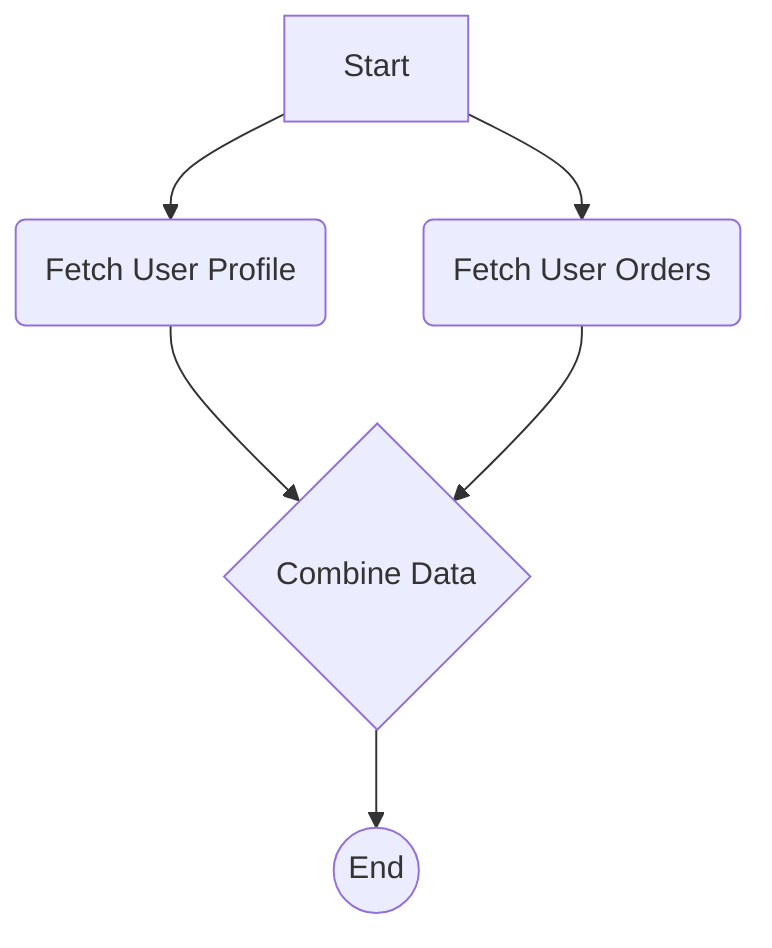

# Cookbook: API Data Aggregation

A common use case for a workflow engine is to orchestrate calls to multiple microservices or third-party APIs and then aggregate the results into a single, combined output.

This recipe demonstrates a workflow that fetches user data from one API and their recent orders from another, then combines them into a single object.

### The Scenario

1.  A workflow is triggered with a `userId`.
2.  **In parallel**, two nodes are executed:
    -   One fetches user profile details from `/api/users/{userId}`.
    -   One fetches a list of orders from `/api/orders/{userId}`.
3.  A final node waits for both API calls to complete, then uses the expression engine to combine their outputs into a single `customerSummary` object.

*Note: The Refluxo engine executes nodes sequentially. True parallelism would require running multiple engine instances or is a feature that could be built on top of the core engine. For this recipe, we will simulate parallelism by running the nodes one after another, as the order does not matter.*

### Visualizing the Workflow


*(While the diagram shows parallel paths, remember the engine executes them sequentially. The "Combine Data" node will simply be the last one to run.)*

### 1. Node Definitions

We need a reusable node for making HTTP requests and a final node for the aggregation.

```typescript
import { object, string, array } from "valibot";

const nodeDefinitions = {
  "fetch-api": {
    input: object({ url: string([url()]) }),
    executor: async (data) => {
      // In a real-world scenario, handle errors properly
      const response = await fetch(data.url);
      return { data: await response.json() };
    },
  },

  "combine-data": {
    // This node's executor doesn't do much.
    // The real work is done by the expression engine on its data property.
    input: object({
      profile: object({}),
      orders: array(object({}))
    }),
    executor: async (data) => {
      // The resolved data is simply returned
      return { data };
    },
  },
};
```

### 2. Workflow Definition

This is where the magic happens. The `combine-data` node uses expressions to pull data from the outputs of the two `fetch-api` nodes.

```typescript
const workflow: WorkflowDefinition = {
  nodes: [
    {
      id: "trigger",
      type: "webhook-trigger", // Receives { userId: "user-123" }
      data: {},
    },
    {
      id: "fetchProfile",
      type: "fetch-api",
      data: {
        // URL is constructed dynamically from the trigger payload
        url: "https://my-api.com/api/users/{{ trigger.last.data.userId }}",
      },
    },
    {
      id: "fetchOrders",
      type: "fetch-api",
      data: {
        url: "https://my-api.com/api/orders/{{ trigger.last.data.userId }}",
      },
    },
    {
      id: "combine",
      type: "combine-data",
      data: {
        // This object is constructed by the expression engine before
        // the 'combine-data' executor is even called.
        profile: "{{ fetchProfile.last.data }}",
        orders: "{{ fetchOrders.last.data.orders }}",
      },
    },
  ],
  edges: [
    { source: "trigger", target: "fetchProfile" },
    { source: "fetchProfile", target: "fetchOrders" },
    { source: "fetchOrders", target: "combine" },
  ],
};
```

### How it Works

When the engine prepares to execute the `combine` node:
1.  It looks at its `data` definition.
2.  It finds the expression `{{ fetchProfile.last.data }}`. It looks into the `Context`, finds the last result of the `fetchProfile` node, and gets its output.
3.  It does the same for `{{ fetchOrders.last.data.orders }}`, getting the output from the `fetchOrders` node.
4.  It constructs a new object: `{ profile: { ... }, orders: [ ... ] }`.
5.  This fully resolved object is then passed as the `data` argument to the `combine-data` executor.

This pattern is incredibly powerful. It allows you to create generic, reusable nodes (`fetch-api`, `combine-data`) and then perform complex, specific business logic declaratively within the workflow definition itself.
