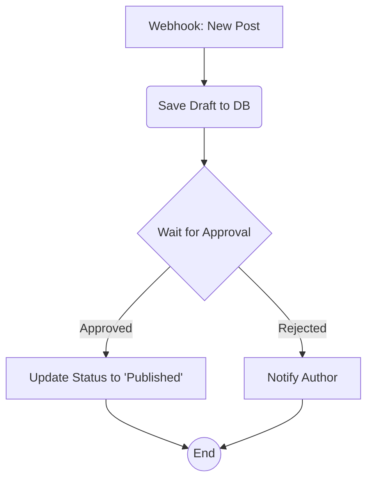

# Cookbook: Content Approval Workflow

This recipe demonstrates how to build a practical, multi-step content approval workflow. A new blog post is submitted, a manager is notified to approve it, and depending on the decision, the post is either published or sent back to the author.

This example combines several core concepts:
- A webhook trigger
- Custom nodes for business logic
- Pausing for human-in-the-loop
- Conditional branching

### The Scenario

1.  A user submits a new blog post via a frontend application.
2.  The frontend sends a webhook to our application to start the workflow.
3.  The workflow saves the draft post to a database, marking its status as `pending_approval`.
4.  It then pauses, waiting for a manager's decision.
5.  A manager, via a separate UI, approves or rejects the post. This action resumes the workflow, providing the decision as a payload.
6.  If approved, a node updates the post's status to `published`.
7.  If rejected, a different node sends an email/notification back to the author.

### Visualizing the Workflow



### 1. Node Definitions

We'll need several custom nodes for this.

```typescript
import { object, string, boolean } from "valibot";
// Assume `db` and `email` are your own imported service clients.

const nodeDefinitions = {
  "webhook-trigger": {
    // A generic trigger node
    executor: async (_, __, payload) => ({ data: payload || {} }),
  },
  
  "save-draft": {
    metadata: {
      input: object({ authorId: string(), title: string(), content: string() }),
    },
    executor: async (data) => {
      const post = await db.posts.create({ ...data, status: "pending_approval" });
      return { data: { postId: post.id } };
    },
  },

  "wait-for-approval": {
    // This node pauses if no decision is provided in the payload
    executor: async (_, __, payload) => {
      if (!payload || typeof (payload as any).approved !== 'boolean') {
        return { data: {}, __pause: true };
      }
      const { approved } = payload as { approved: boolean };
      return {
        data: { decision: approved ? "approved" : "rejected" },
        nextHandle: approved ? "approved" : "rejected",
      };
    },
  },

  "publish-post": {
    metadata: {
      input: object({ postId: string() }),
    },
    executor: async (data) => {
      await db.posts.update({ where: { id: data.postId }, data: { status: "published" } });
      return { data: { published: true } };
    },
  },

  "notify-author": {
    metadata: {
      input: object({ authorId: string() }),
    },
    executor: async (data) => {
      await email.send({ to: data.authorId, message: "Your post was rejected." });
      return { data: { notified: true } };
    },
  },
};
```

### 2. Definição do Workflow

The workflow wires these nodes together, using expressions to pass data between them.

```typescript
const workflow: WorkflowDefinition = {
  nodes: [
    {
      id: "trigger",
      type: "webhook-trigger",
      data: {},
    },
    {
      id: "save",
      type: "save-draft",
      // Data comes from the initial webhook payload
      data: {
        authorId: "{{ trigger.last.data.authorId }}",
        title: "{{ trigger.last.data.title }}",
        content: "{{ trigger.last.data.content }}",
      },
    },
    {
      id: "approval",
      type: "wait-for-approval",
      data: {},
    },
    {
      id: "publish",
      type: "publish-post",
      // The postId comes from the 'save' node's output
      data: { postId: "{{ save.last.data.postId }}" },
    },
    {
      id: "notify",
      type: "notify-author",
      // The authorId also comes from the initial payload
      data: { authorId: "{{ trigger.last.data.authorId }}" },
    },
  ],
  edges: [
    { source: "trigger", target: "save" },
    { source: "save", target: "approval" },
    { source: "approval", target: "publish", sourceHandle: "approved" },
    { source: "approval", target: "notify", sourceHandle: "rejected" },
  ],
};
```

This recipe shows how you can combine simple, single-purpose nodes into a sophisticated, resilient, and long-running business process.
