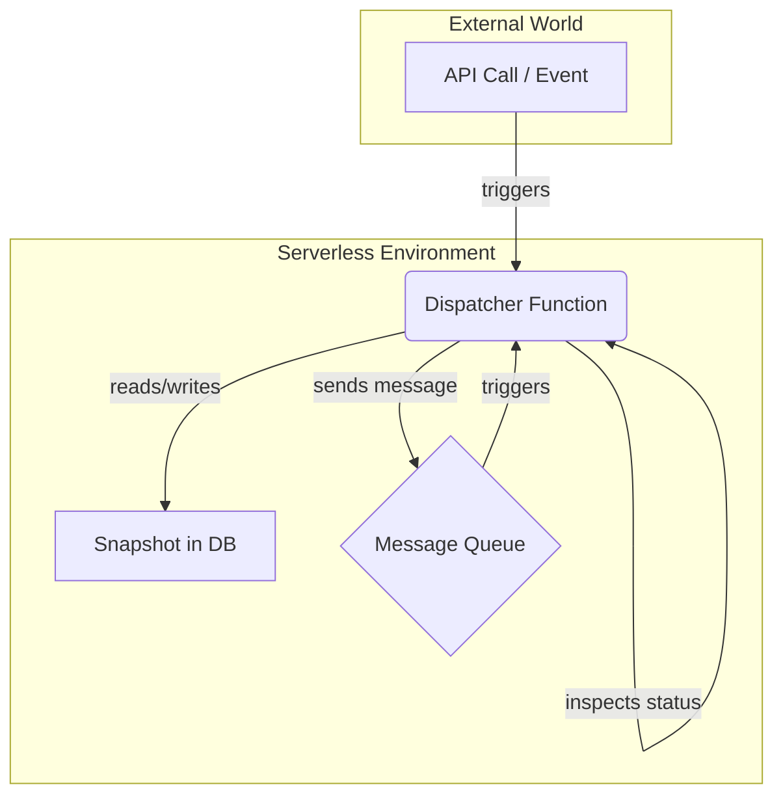

# Deployment: Serverless Patterns

The Refluxo engine's stateless, step-by-step execution model is a perfect match for serverless environments like AWS Lambda, Google Cloud Functions, or Cloudflare Workers. These platforms are designed for short-lived, event-driven computations, which is exactly how the engine operates.

This guide outlines a common and effective pattern for deploying a Refluxo-based application in a serverless architecture.

## The Core Pattern: The "Dispatcher" Function

Instead of having one long-running process, you have a single, stateless serverless function (let's call it the "Dispatcher") that is responsible for executing **one step** of a workflow.

The architecture relies on a persistent database (for state) and a message queue (for scheduling).

Here's the flow:

1.  **Trigger**: An initial event (e.g., an HTTP request to an API Gateway, a new file in an S3 bucket) invokes the Dispatcher function with an initial payload.
2.  **Create or Load State**: The Dispatcher creates a new `Snapshot` or loads an existing one from the database (e.g., DynamoDB).
3.  **Execute One Step**: It calls `engine.executeStep()` with the snapshot. This is a crucial difference from `engine.execute()`, as we only want to process a single node to keep the function's execution time short.
4.  **Process the Result**: The Dispatcher inspects the new snapshot returned by `executeStep()`.
5.  **Save State**: It saves the new snapshot to the database.
6.  **Schedule Next Step**:
    -   If the new snapshot's status is `active`, the Dispatcher sends a message **to itself** via a message queue (e.g., SQS) to trigger the next step immediately. The message payload is simply the `workflowId`.
    -   If the status is `error` (pending a retry), it sends a message to itself with a **delay**, calculated from the `retryState.nextRetryAt` timestamp.
    -   If the status is `paused`, `completed`, or `failed`, it does nothing. The workflow execution stops until another external event (like a webhook) triggers it again.

### Visual Representation



## Example: AWS Lambda + SQS + DynamoDB

Here is a simplified example of what a Dispatcher function might look like on AWS.

```typescript
import { SQSClient, SendMessageCommand } from "@aws-sdk/client-sqs";
import { DynamoDBClient } from "@aws-sdk/client-dynamodb";
// Assume you have service files for interacting with DynamoDB
import { getSnapshot, saveSnapshot } from "./database"; 
import { engine } from "./engine"; // Your configured engine instance

const sqsClient = new SQSClient({});
const queueUrl = process.env.QUEUE_URL;

export async function handler(event) {
  // The event could come from API Gateway, SQS, etc.
  const { workflowId, externalPayload, isNew } = parseEvent(event);

  let snapshot;
  if (isNew) {
    snapshot = engine.createInitialSnapshot(workflowId, "start-node");
  } else {
    snapshot = await getSnapshot(workflowId);
    // If the workflow is already finished, do nothing.
    if (["completed", "failed"].includes(snapshot.status)) return;
  }
  
  // Set status to active if it was paused or in a retry state
  if (["paused", "error"].includes(snapshot.status)) {
    snapshot.status = "active";
  }

  // Execute just one step
  const newSnapshot = await engine.executeStep(snapshot, externalPayload);

  // Save the new state
  await saveSnapshot(newSnapshot);

  // Schedule the next action
  if (newSnapshot.status === "active") {
    // Trigger next step immediately
    await sqsClient.send(new SendMessageCommand({
      QueueUrl: queueUrl,
      MessageBody: JSON.stringify({ workflowId: newSnapshot.workflowId })
    }));
  } else if (newSnapshot.status === "error" && newSnapshot.retryState) {
    // Trigger next step with a delay for the retry
    const delaySeconds = Math.ceil(
      (newSnapshot.retryState.nextRetryAt - Date.now()) / 1000
    );
    await sqsClient.send(new SendMessageCommand({
      QueueUrl: queueUrl,
      MessageBody: JSON.stringify({ workflowId: newSnapshot.workflowId }),
      DelaySeconds: Math.max(0, Math.min(delaySeconds, 900)), // SQS max delay is 15 mins
    }));
  }
  // If paused, completed, or failed, the process stops here.
}
```

This pattern is highly scalable, resilient, and cost-effective, as you only pay for the brief moments when your workflow is actively processing a step.