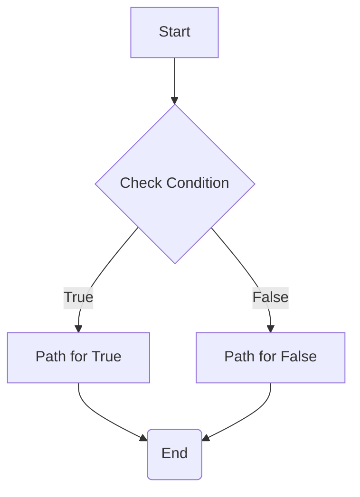

# Conditionals and Branching

Workflows often require conditional logic to execute different branches based on certain criteria. The Refluxo engine handles this not by having a complex "if-node", but by using output handles on nodes and edges.

This approach keeps the engine simple and makes the workflow's branching logic visible and explicit in its definition.

## How it Works: `sourceHandle`

1.  **The Node Decides**: A node's `executor` function can return a `nextHandle` property in its result. This string acts as a label for the "exit port" that the execution should take.

2.  **The Edge Listens**: An `Edge` definition can include a `sourceHandle` property.

3.  **The Engine Connects**: After a node executes, the engine looks for an edge whose `source` is the current node and whose `sourceHandle` matches the `nextHandle` returned by the executor.

If no `nextHandle` is returned, the engine will look for an edge that also has no `sourceHandle` defined (or has it set to `undefined`), which acts as the default path.

## Example: A Simple "If" Condition

Here's a visual representation of a conditional workflow:



Let's create a workflow that checks if a number is positive or negative.

### 1. The Conditional Node Definition

We'll create a `check-number` node. Its executor will check the input and return a different `nextHandle` based on the result.

```typescript
const nodeDefinitions: NodesDefinition = {
  "check-number": {
    input: { type: "object", properties: { value: { type: "number" } } },
    output: { type: "object" }, // This node only directs flow, doesn't output much
    executor: async (data) => {
      const { value } = data as { value: number };
      
      if (value > 0) {
        return { data: { check: "positive" }, nextHandle: "positive" };
      } else {
        return { data: { check: "non-positive" }, nextHandle: "negative" };
      }
    },
  },
  "log-positive": {
    /* ... executor that logs a positive message ... */
  },
  "log-negative": {
    /* ... executor that logs a negative message ... */
  },
};
```

### 2. The Workflow Definition

In the workflow, we define two edges originating from our `check-number` node. Each edge listens for a specific `sourceHandle`.

```typescript
const workflow: WorkflowDefinition = {
  nodes: [
    { id: "start", type: "check-number", data: { value: -10 } },
    { id: "positive_branch", type: "log-positive", data: {} },
    { id: "negative_branch", type: "log-negative", data: {} },
  ],
  edges: [
    // Edge for the "positive" branch
    {
      id: "e1",
      source: "start",
      target: "positive_branch",
      sourceHandle: "positive", // Listens for the "positive" handle
    },
    // Edge for the "negative" branch
    {
      id: "e2",
      source: "start",
      target: "negative_branch",
      sourceHandle: "negative", // Listens for the "negative" handle
    },
  ],
};
```

When this workflow runs:
1. The `start` node (`check-number`) executes with `value: -10`.
2. The executor logic finds that the value is not positive and returns `{ data: { ... }, nextHandle: "negative" }`.
3. The engine searches for an edge from `source: "start"` with `sourceHandle: "negative"`.
4. It finds edge `e2` and sets the next node to `negative_branch`.

This pattern can be used to build everything from simple if/else branches to complex multi-path switches.