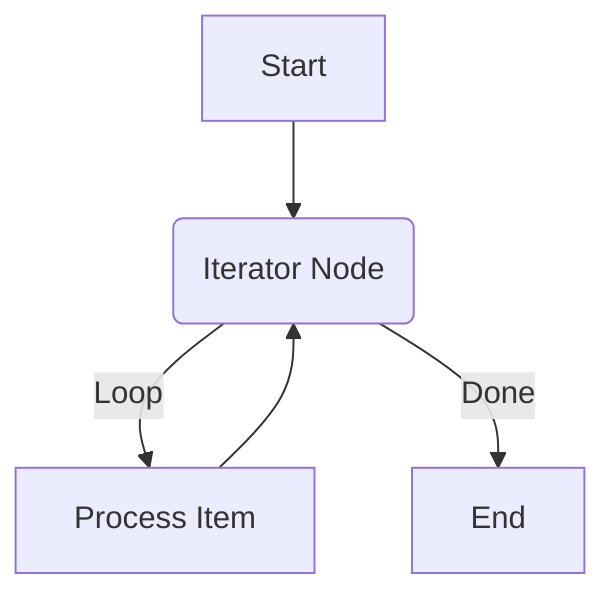

# Handling Loops

The Refluxo engine supports loops by simply having an edge point to a node that has already been executed. The engine's design, which stores execution history in the `Context`, is built to handle this scenario gracefully without losing state.

## The Strategy: Iterator Node

The most common and manageable way to implement a loop is by creating an "Iterator" node. This node takes an array as input and processes one item at a time, looping back to itself until all items are processed.

An iterator node typically has two output handles:
-   `"loop"`: Followed for each item in the array. This handle connects to the part of the workflow that processes the item.
-   `"done"`: Followed when all items have been processed.

Here's a visual representation of a loop:



## Example: Processing an Array

Let's create a workflow that iterates over an array of numbers and logs each one.

### 1. The Iterator Node Definition

The iterator's logic relies on the `Context` to know which item to process next. It checks the history of its own executions to determine the current index.

```typescript
const nodeDefinitions: NodesDefinition = {
  "iterator": {
    input: {
      type: "object",
      properties: { items: { type: "array" } },
      required: ["items"],
    },
    output: { type: "object" },
    executor: async (data, context) => {
      // Get the number of times this node has already run
      const
       executionCount = context["iteratorNode"]?.length || 0;
      const items = (data as { items: any[] }).items;

      if (executionCount < items.length) {
        // There are more items to process
        return {
          data: {
            // Output the current item and its index
            currentItem: items[executionCount],
            currentIndex: executionCount,
          },
          nextHandle: "loop", // Follow the "loop" path
        };
      } else {
        // All items have been processed
        return {
          data: {
            totalItems: items.length,
          },
          nextHandle: "done", // Follow the "done" path
        };
      }
    },
  },
  "log-item": {
    /* ... executor that receives and logs an item ... */
    input: { type: "object" },
    output: { type: "object" },
    executor: async (data) => {
      console.log("Processing Item:", data);
      return { data };
    },
  },
};
```
*Note: We use the node's own ID (`iteratorNode`) to check its execution history in the context.*

### 2. The Workflow Definition

The workflow definition shows the circular data flow. The `log-item` node connects back to the `iterator` node, creating the loop.

```typescript
const workflow: WorkflowDefinition = {
  nodes: [
    {
      id: "iteratorNode",
      type: "iterator",
      data: { items: [10, 20, 30] }, // The array to iterate over
    },
    {
      id: "logNode",
      type: "log-item",
      // Get the item to log from the iterator's output
      data: { item: "{{ `iteratorNode`.last.data.currentItem }}" },
    },
    { id: "endNode", type: "log-final", data: {} }, // Some node to execute after the loop
  ],
  edges: [
    // 1. The "loop" path: iterator -> log -> iterator
    {
      id: "e1",
      source: "iteratorNode",
      target: "logNode",
      sourceHandle: "loop",
    },
    {
      id: "e2",
      source: "logNode",
      target: "iteratorNode", // Connects back to the iterator
    },
    // 2. The "done" path: iterator -> end
    {
      id: "e3",
      source: "iteratorNode",
      target: "endNode",
      sourceHandle: "done",
    },
  ],
};
```

When this workflow runs, the `iteratorNode` will execute 4 times. The first 3 times, it will follow the `loop` path. On the 4th execution, it will find that all items have been processed and will follow the `done` path, breaking the loop.