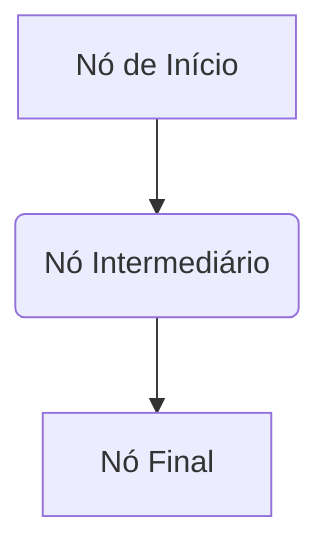

# Workflow & Node Definition

Um workflow (fluxo de trabalho) é o blueprint para uma execução. É uma estrutura JSON declarativa que define as tarefas (Nós) e as conexões entre eles (Arestas ou `Edges`).

## WorkflowDefinition

Este é o objeto principal que você fornece ao `WorkflowEngine`. Ele consiste em duas partes principais:

-   `nodes`: Um array de objetos `Node`.
-   `edges`: Um array de objetos `Edge` que conectam os nós.

```typescript
const workflowDefinition: WorkflowDefinition = {
  nodes: [
    { id: "n1", type: "my-custom-node", data: { message: "Olá" } },
    { id: "n2", type: "another-node", data: { value: 123 } }
  ],
  edges: [
    { id: "e1", source: "n1", target: "n2" }
  ]
};
```

Aqui está uma representação visual de um workflow simples:



### Node

Um `Node` (nó) é uma única unidade de trabalho em seu workflow. Ele possui:
- `id`: Um identificador único para o nó dentro do workflow.
- `type`: Uma string que mapeia para uma `NodeDefinition`.
- `data`: Um objeto JSON contendo a configuração estática para esta instância do nó. Estes dados podem se tornar dinâmicos usando [expressões](./expressions.md).

### Edge

Um `Edge` (aresta) define o fluxo de execução entre os nós. Ele possui:
- `id`: Um identificador único para a aresta.
- `source`: O ID do nó de onde a aresta se origina.
- `target`: O ID do nó onde a aresta termina.
- `sourceHandle` (opcional): Uma chave para implementar lógica condicional. Para mais detalhes, veja o [guia de Condicionais](../guides/conditionals.md).

## NodeDefinition

Enquanto a `WorkflowDefinition` descreve a estrutura, a `NodeDefinition` (definição de nó) descreve o comportamento. É um objeto JavaScript que informa ao motor como um certo `type` de nó deve operar.

Você fornece um objeto contendo todas as suas `NodeDefinition`s quando instancia o `WorkflowEngine`. Uma biblioteca de definição de schema compatível com **Standard Schema** (como Valibot ou Zod) deve ser usada.

```typescript
import { object, string, parse } from "valibot"; // Usando a sintaxe do valibot

const nodeDefinitions = {
  "my-custom-node": {
    // Schema para validação da entrada
    input: object({ message: string() }),
    // Schema para validação da saída
    output: object({ status: string() }),
    // A lógica de execução
    executor: async (data) => {
      // O tipo de 'data' é inferido do schema de 'input'
      console.log(data.message); // "Olá"
      return { data: { status: "ok" } };
    }
  },
  // ... outras definições de nós
};
```

Uma `NodeDefinition` contém:
- `input`: Um Standard Schema para validar os dados de entrada resolvidos do nó.
- `output`: Um Standard Schema para validar os dados retornados pelo executor.
- `retryPolicy`: Uma política opcional para [tratamento de erros](../guides/error-handling.md).
- `executor`: Uma função `async` que contém a lógica de negócio do nó. Ela recebe os `data` resolvidos e o `context` completo, e deve retornar um objeto contendo os `data` a serem passados adiante.
