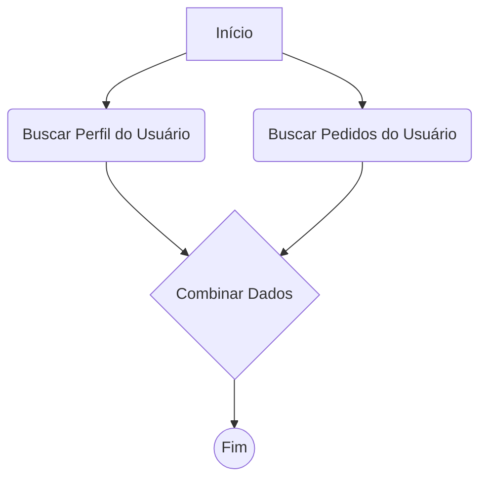

# Receita: Agregação de Dados de APIs

Um caso de uso comum para um motor de workflow é orquestrar chamadas para múltiplos microsserviços ou APIs de terceiros e, em seguida, agregar os resultados em uma única saída combinada.

Esta receita demonstra um workflow que busca dados de um usuário de uma API e seus pedidos recentes de outra, e então os combina em um único objeto.

### O Cenário

1.  Um workflow é acionado com um `userId`.
2.  **Em paralelo**, dois nós são executados:
    -   Um busca detalhes do perfil do usuário em `/api/users/{userId}`.
    -   Um busca uma lista de pedidos em `/api/orders/{userId}`.
3.  Um nó final aguarda a conclusão de ambas as chamadas de API e, em seguida, usa a engine de expressões para combinar suas saídas em um único objeto `customerSummary`.

*Nota: A engine Refluxo executa os nós sequencialmente. O verdadeiro paralelismo exigiria a execução de múltiplas instâncias da engine ou é uma funcionalidade que poderia ser construída sobre o núcleo da engine. Para esta receita, simularemos o paralelismo executando os nós um após o outro, já que a ordem não importa.*

### Visualizando o Workflow


*(Embora o diagrama mostre caminhos paralelos, lembre-se que a engine os executa sequencialmente. O nó "Combinar Dados" será simplesmente o último a ser executado.)*

### 1. Definições dos Nós

Precisamos de um nó reutilizável para fazer requisições HTTP e um nó final para a agregação.

```typescript
import { object, string, array } from "valibot";

const nodeDefinitions = {
  "fetch-api": {
    input: object({ url: string([url()]) }),
    executor: async (data) => {
      // Em um cenário real, trate os erros adequadamente
      const response = await fetch(data.url);
      return { data: await response.json() };
    },
  },

  "combine-data": {
    // O executor deste nó não faz muito.
    // O trabalho real é feito pela engine de expressões em sua propriedade data.
    input: object({
      profile: object({}),
      orders: array(object({}))
    }),
    executor: async (data) => {
      // Os dados resolvidos são simplesmente retornados
      return { data };
    },
  },
};
```

### 2. Definição do Workflow

É aqui que a mágica acontece. O nó `combine-data` usa expressões para extrair dados das saídas dos dois nós `fetch-api`.

```typescript
const workflow: WorkflowDefinition = {
  nodes: [
    {
      id: "trigger",
      type: "webhook-trigger", // Recebe { userId: "user-123" }
      data: {},
    },
    {
      id: "fetchProfile",
      type: "fetch-api",
      data: {
        // A URL é construída dinamicamente a partir do payload do trigger
        url: "https://my-api.com/api/users/{{ trigger.last.data.userId }}",
      },
    },
    {
      id: "fetchOrders",
      type: "fetch-api",
      data: {
        url: "https://my-api.com/api/orders/{{ trigger.last.data.userId }}",
      },
    },
    {
      id: "combine",
      type: "combine-data",
      data: {
        // Este objeto é construído pela engine de expressões antes mesmo
        // do executor 'combine-data' ser chamado.
        profile: "{{ fetchProfile.last.data }}",
        orders: "{{ fetchOrders.last.data.orders }}",
      },
    },
  ],
  edges: [
    { source: "trigger", target: "fetchProfile" },
    { source: "fetchProfile", target: "fetchOrders" },
    { source: "fetchOrders", target: "combine" },
  ],
};
```

### Como Funciona

::: v-pre
Quando a engine se prepara para executar o nó `combine`:
1.  Ela olha para a definição de seus `data`.
2.  Encontra a expressão `{{ fetchProfile.last.data }}`. Procura no `Context`, encontra o último resultado do nó `fetchProfile` e obtém sua saída.
3.  Faz o mesmo para `{{ fetchOrders.last.data.orders }}`, obtendo a saída do nó `fetchOrders`.
4.  Constrói um novo objeto: `{ profile: { ... }, orders: [ ... ] }`.
5.  Este objeto totalmente resolvido é então passado como o argumento `data` para o executor `combine-data`.
:::

Este padrão é incrivelmente poderoso. Ele permite que você crie nós genéricos e reutilizáveis (`fetch-api`, `combine-data`) e, em seguida, realize lógicas de negócio complexas e específicas de forma declarativa, dentro da própria definição do workflow.
