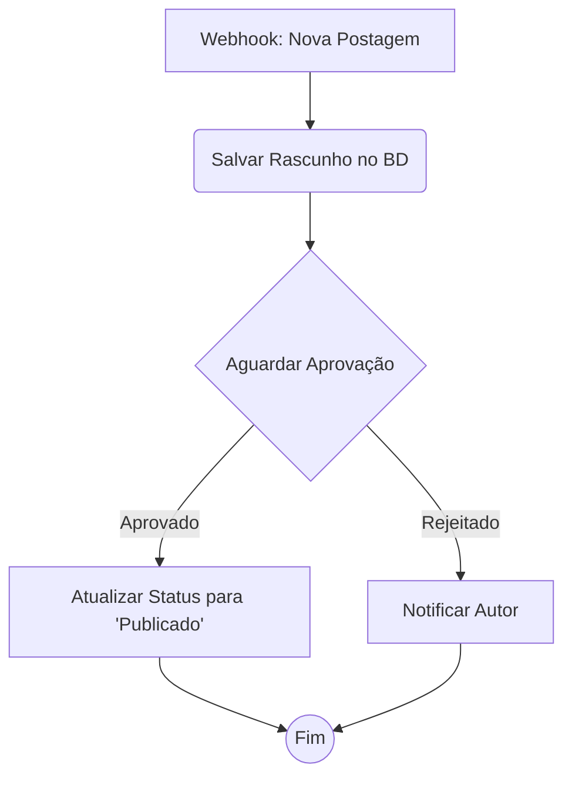

# Receita: Workflow de Aprovação de Conteúdo

Esta receita demonstra como construir um workflow de aprovação de conteúdo prático e com múltiplos passos. Uma nova postagem de blog é enviada, um gerente é notificado para aprová-la e, dependendo da decisão, a postagem é publicada ou enviada de volta ao autor.

Este exemplo combina vários conceitos fundamentais:
- Um trigger de webhook
- Nós customizados para lógica de negócio
- Pausa para intervenção humana (human-in-the-loop)
- Ramificação condicional

### O Cenário

1.  Um usuário envia uma nova postagem de blog através de uma aplicação frontend.
2.  O frontend envia um webhook para nossa aplicação para iniciar o workflow.
3.  O workflow salva o rascunho da postagem em um banco de dados, marcando seu status como `pending_approval`.
4.  Em seguida, ele pausa, aguardando a decisão de um gerente.
5.  Um gerente, através de uma UI separada, aprova ou rejeita a postagem. Essa ação retoma o workflow, fornecendo a decisão como um payload.
6.  Se aprovado, um nó atualiza o status da postagem para `published`.
7.  Se rejeitado, um nó diferente envia um e-mail/notificação de volta para o autor.

### Visualizando o Workflow



### 1. Definições dos Nós

Precisaremos de vários nós customizados para isso.

```typescript
import { object, string, boolean } from "valibot";
// Suponha que `db` e `email` são seus próprios clientes de serviço importados.

const nodeDefinitions = {
  "webhook-trigger": {
    // Um nó de trigger genérico
    executor: async (_, __, payload) => ({ data: payload || {} }),
  },
  
  "save-draft": {
    metadata: {
      input: object({ authorId: string(), title: string(), content: string() }),
    },
    executor: async (data) => {
      const post = await db.posts.create({ ...data, status: "pending_approval" });
      return { data: { postId: post.id } };
    },
  },

  "wait-for-approval": {
    // Este nó pausa se nenhuma decisão for fornecida no payload
    executor: async (_, __, payload) => {
      if (!payload || typeof (payload as any).approved !== 'boolean') {
        return { data: {}, __pause: true };
      }
      const { approved } = payload as { approved: boolean };
      return {
        data: { decision: approved ? "approved" : "rejected" },
        nextHandle: approved ? "approved" : "rejected",
      };
    },
  },

  "publish-post": {
    metadata: {
      input: object({ postId: string() }),
    },
    executor: async (data) => {
      await db.posts.update({ where: { id: data.postId }, data: { status: "published" } });
      return { data: { published: true } };
    },
  },

  "notify-author": {
    metadata: {
      input: object({ authorId: string() }),
    },
    executor: async (data) => {
      await email.send({ to: data.authorId, message: "Sua postagem foi rejeitada." });
      return { data: { notified: true } };
    },
  },
};
```

### 2. Definição do Workflow

O workflow conecta esses nós, usando expressões para passar dados entre eles.

```typescript
const workflow: WorkflowDefinition = {
  nodes: [
    {
      id: "trigger",
      type: "webhook-trigger",
      data: {},
    },
    {
      id: "save",
      type: "save-draft",
      // Os dados vêm do payload inicial do webhook
      data: {
        authorId: "{{ trigger.last.data.authorId }}",
        title: "{{ trigger.last.data.title }}",
        content: "{{ trigger.last.data.content }}",
      },
    },
    {
      id: "approval",
      type: "wait-for-approval",
      data: {},
    },
    {
      id: "publish",
      type: "publish-post",
      // O postId vem da saída do nó 'save'
      data: { postId: "{{ save.last.data.postId }}" },
    },
    {
      id: "notify",
      type: "notify-author",
      // O authorId também vem do payload inicial
      data: { authorId: "{{ trigger.last.data.authorId }}" },
    },
  ],
  edges: [
    { source: "trigger", target: "save" },
    { source: "save", target: "approval" },
    { source: "approval", target: "publish", sourceHandle: "approved" },
    { source: "approval", target: "notify", sourceHandle: "rejected" },
  ],
};
```

Esta receita mostra como você pode combinar nós simples e de propósito único em um processo de negócio sofisticado, resiliente e de longa duração.
