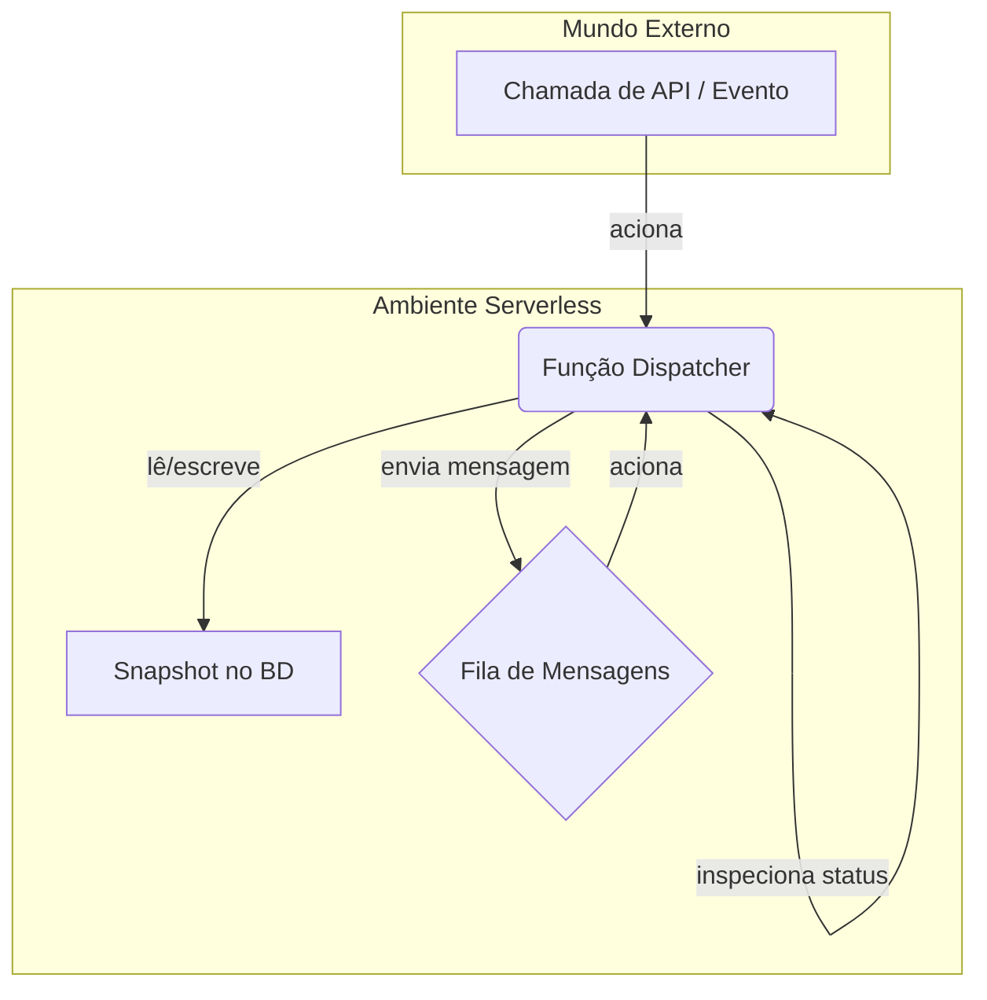

# Deployment: Padrões Serverless

O modelo de execução "passo a passo" e stateless da engine Refluxo é uma combinação perfeita para ambientes serverless como AWS Lambda, Google Cloud Functions ou Cloudflare Workers. Essas plataformas são projetadas para computações de curta duração e orientadas a eventos, que é exatamente como a engine opera.

Este guia descreve um padrão comum e eficaz para implantar uma aplicação baseada em Refluxo em uma arquitetura serverless.

## O Padrão Central: A Função "Dispatcher"

Em vez de ter um processo de longa duração, você tem uma única função serverless stateless (vamos chamá-la de "Dispatcher") que é responsável por executar **um passo** de um workflow.

A arquitetura depende de um banco de dados persistente (para o estado) e de uma fila de mensagens (para o agendamento).

O fluxo é o seguinte:

1.  **Trigger (Acionador)**: Um evento inicial (ex: uma requisição HTTP a um API Gateway, um novo arquivo em um bucket S3) invoca a função Dispatcher com um payload inicial.
2.  **Criar ou Carregar Estado**: O Dispatcher cria um novo `Snapshot` ou carrega um existente do banco de dados (ex: DynamoDB).
3.  **Executar Um Passo**: Ele chama `engine.executeStep()` com o snapshot. Esta é uma diferença crucial em relação ao `engine.execute()`, pois queremos processar apenas um único nó para manter o tempo de execução da função curto.
4.  **Processar o Resultado**: O Dispatcher inspeciona o novo snapshot retornado pelo `executeStep()`.
5.  **Salvar Estado**: Ele salva o novo snapshot no banco de dados.
6.  **Agendar Próximo Passo**:
    -   Se o status do novo snapshot for `active`, o Dispatcher envia uma mensagem **para si mesmo** através de uma fila de mensagens (ex: SQS) para acionar o próximo passo imediatamente. O payload da mensagem é simplesmente o `workflowId`.
    -   Se o status for `error` (aguardando uma retentativa), ele envia uma mensagem para si mesmo com um **atraso (delay)**, calculado a partir do timestamp `retryState.nextRetryAt`.
    -   Se o status for `paused`, `completed` ou `failed`, ele não faz nada. A execução do workflow para até que outro evento externo (como um webhook) a acione novamente.

### Representação Visual



## Exemplo: AWS Lambda + SQS + DynamoDB

Aqui está um exemplo simplificado de como uma função Dispatcher poderia se parecer na AWS.

```typescript
import { SQSClient, SendMessageCommand } from "@aws-sdk/client-sqs";
import { DynamoDBClient } from "@aws-sdk/client-dynamodb";
// Suponha que você tenha arquivos de serviço para interagir com o DynamoDB
import { getSnapshot, saveSnapshot } from "./database"; 
import { engine } from "./engine"; // Sua instância da engine configurada

const sqsClient = new SQSClient({});
const queueUrl = process.env.QUEUE_URL;

export async function handler(event) {
  // O evento pode vir de um API Gateway, SQS, etc.
  const { workflowId, externalPayload, isNew } = parseEvent(event);

  let snapshot;
  if (isNew) {
    snapshot = engine.createInitialSnapshot(workflowId, "start-node");
  } else {
    snapshot = await getSnapshot(workflowId);
    // Se o workflow já terminou, não faz nada.
    if (["completed", "failed"].includes(snapshot.status)) return;
  }
  
  // Define o status como ativo se estava pausado ou em retentativa
  if (["paused", "error"].includes(snapshot.status)) {
    snapshot.status = "active";
  }

  // Executa apenas um passo
  const newSnapshot = await engine.executeStep(snapshot, externalPayload);

  // Salva o novo estado
  await saveSnapshot(newSnapshot);

  // Agenda a próxima ação
  if (newSnapshot.status === "active") {
    // Aciona o próximo passo imediatamente
    await sqsClient.send(new SendMessageCommand({
      QueueUrl: queueUrl,
      MessageBody: JSON.stringify({ workflowId: newSnapshot.workflowId })
    }));
  } else if (newSnapshot.status === "error" && newSnapshot.retryState) {
    // Aciona o próximo passo com um atraso para a retentativa
    const delaySeconds = Math.ceil(
      (newSnapshot.retryState.nextRetryAt - Date.now()) / 1000
    );
    await sqsClient.send(new SendMessageCommand({
      QueueUrl: queueUrl,
      MessageBody: JSON.stringify({ workflowId: newSnapshot.workflowId }),
      DelaySeconds: Math.max(0, Math.min(delaySeconds, 900)), // Atraso máx. do SQS é de 15 min
    }));
  }
  // Se estiver pausado, concluído ou falho, o processo para aqui.
}
```

Este padrão é altamente escalável, resiliente e econômico, pois você paga apenas pelos breves momentos em que seu workflow está processando ativamente um passo.