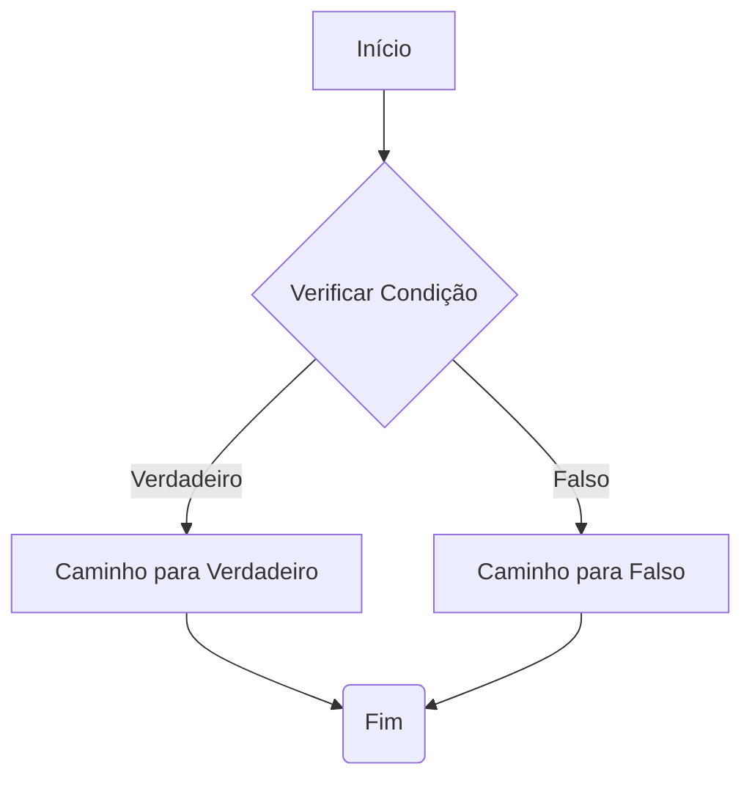

# Condicionais e Ramificação

Workflows frequentemente exigem lógica condicional para executar diferentes ramificações (branches) com base em certos critérios. A engine Refluxo lida com isso não por ter um "nó-if" complexo, mas usando "handles" de saída nos nós e arestas.

Essa abordagem mantém a engine simples e torna a lógica de ramificação do workflow visível e explícita em sua definição.

## Como Funciona: `sourceHandle`

1.  **O Nó Decide**: A função `executor` de um nó pode retornar uma propriedade `nextHandle` em seu resultado. Essa string atua como um rótulo para a "porta de saída" que a execução deve seguir.

2.  **A Aresta Escuta**: Uma definição de `Edge` (aresta) pode incluir uma propriedade `sourceHandle`.

3.  **A Engine Conecta**: Após a execução de um nó, a engine procura por uma aresta cujo `source` seja o nó atual e cujo `sourceHandle` corresponda ao `nextHandle` retornado pelo executor.

Se nenhum `nextHandle` for retornado, a engine procurará por uma aresta que também não tenha `sourceHandle` definido (ou o tenha como `undefined`), que atua como o caminho padrão.

## Exemplo: Uma Condição "If" Simples

Aqui está uma representação visual de um workflow condicional:



Vamos criar um workflow que verifica se um número é positivo ou negativo.

### 1. A Definição do Nó Condicional

Criaremos um nó `check-number`. Seu executor verificará a entrada e retornará um `nextHandle` diferente com base no resultado.

```typescript
const nodeDefinitions: NodesDefinition = {
  "check-number": {
    metadata: {
      input: { type: "object", properties: { value: { type: "number" } } },
      output: { type: "object" }, // Este nó apenas direciona o fluxo, não gera muitos dados
    },
    executor: async (data) => {
      const { value } = data as { value: number };
      
      if (value > 0) {
        return { data: { check: "positive" }, nextHandle: "positive" };
      } else {
        return { data: { check: "non-positive" }, nextHandle: "negative" };
      }
    },
  },
  "log-positive": {
    /* ... executor que loga uma mensagem positiva ... */
  },
  "log-negative": {
    /* ... executor que loga uma mensagem negativa ... */
  },
};
```

### 2. A Definição do Workflow

No workflow, definimos duas arestas partindo do nosso nó `check-number`. Cada aresta "escuta" por um `sourceHandle` específico.

```typescript
const workflow: WorkflowDefinition = {
  nodes: [
    { id: "start", type: "check-number", data: { value: -10 } },
    { id: "positive_branch", type: "log-positive", data: {} },
    { id: "negative_branch", type: "log-negative", data: {} },
  ],
  edges: [
    // Aresta para a ramificação "positiva"
    {
      id: "e1",
      source: "start",
      target: "positive_branch",
      sourceHandle: "positive", // Escuta pelo handle "positive"
    },
    // Aresta para a ramificação "negativa"
    {
      id: "e2",
      source: "start",
      target: "negative_branch",
      sourceHandle: "negative", // Escuta pelo handle "negative"
    },
  ],
};
```

Quando este workflow é executado:
1. O nó `start` (`check-number`) executa com `value: -10`.
2. A lógica do executor conclui que o valor não é positivo e retorna `{ data: { ... }, nextHandle: "negative" }`.
3. A engine busca por uma aresta de `source: "start"` com `sourceHandle: "negative"`.
4. Ela encontra a aresta `e2` e define o próximo nó como `negative_branch`.

Este padrão pode ser usado para construir desde simples ramificações if/else até complexos switches com múltiplos caminhos.
