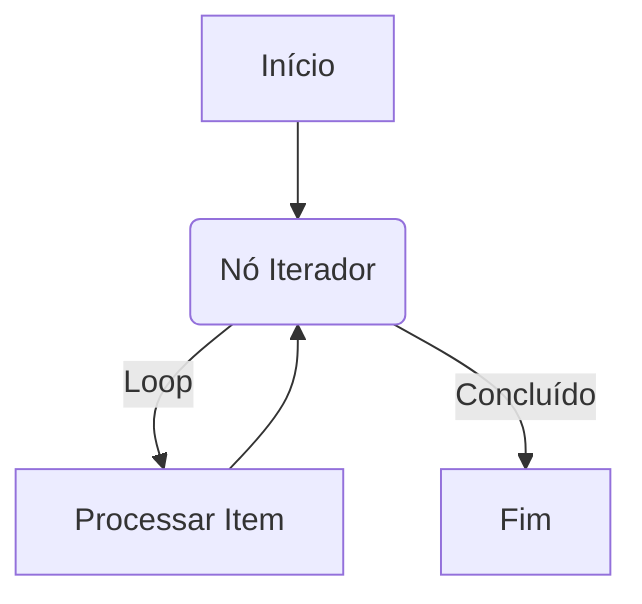

# Lidando com Loops

A engine Refluxo suporta loops simplesmente permitindo que uma aresta aponte para um nó que já foi executado. O design da engine, que armazena o histórico de execução no `Context`, foi construído para lidar com esse cenário de forma elegante e sem perda de estado.

## A Estratégia: Nó Iterador

A maneira mais comum e gerenciável de implementar um loop é criando um nó "Iterador". Este nó recebe um array como entrada e processa um item de cada vez, voltando para si mesmo em loop até que todos os itens sejam processados.

Um nó iterador normalmente possui dois "handles" de saída:
-   `"loop"`: Seguido para cada item no array. Este handle se conecta à parte do workflow que processa o item.
-   `"done"`: Seguido quando todos os itens foram processados.

Aqui está uma representação visual de um loop:



## Exemplo: Processando um Array

Vamos criar um workflow que itera sobre um array de números e exibe cada um no console.

### 1. A Definição do Nó Iterador

A lógica do iterador depende do `Context` para saber qual item processar em seguida. Ele verifica o histórico de suas próprias execuções para determinar o índice atual.

```typescript
const nodeDefinitions: NodesDefinition = {
  "iterator": {
    metadata: {
      input: {
        type: "object",
        properties: { items: { type: "array" } },
        required: ["items"],
      },
      output: { type: "object" },
    },
    executor: async (data, context) => {
      // Pega o número de vezes que este nó já foi executado
      const executionCount = context["iteratorNode"]?.length || 0;
      const items = (data as { items: any[] }).items;

      if (executionCount < items.length) {
        // Ainda há itens para processar
        return {
          data: {
            // Retorna o item atual e seu índice
            currentItem: items[executionCount],
            currentIndex: executionCount,
          },
          nextHandle: "loop", // Segue o caminho "loop"
        };
      } else {
        // Todos os itens foram processados
        return {
          data: {
            totalItems: items.length,
          },
          nextHandle: "done", // Segue o caminho "done"
        };
      }
    },
  },
  "log-item": {
    /* ... executor que recebe e loga um item ... */
    metadata: {
      input: { type: "object" },
      output: { type: "object" },
    },
    executor: async (data) => {
      console.log("Processando Item:", data);
      return { data };
    },
  },
};
```
*Nota: Usamos o próprio ID do nó (`iteratorNode`) para verificar seu histórico de execução no contexto.*

### 2. A Definição do Workflow

A definição do workflow mostra o fluxo de dados circular. O nó `log-item` se conecta de volta ao nó `iterator`, criando o loop.

```typescript
const workflow: WorkflowDefinition = {
  nodes: [
    {
      id: "iteratorNode",
      type: "iterator",
      data: { items: [10, 20, 30] }, // O array a ser iterado
    },
    {
      id: "logNode",
      type: "log-item",
      // Pega o item a ser logado da saída do iterador
      data: { item: "{{ `iteratorNode`.last.data.currentItem }}" },
    },
    { id: "endNode", type: "log-final", data: {} }, // Um nó para ser executado após o loop
  ],
  edges: [
    // 1. O caminho "loop": iterator -> log -> iterator
    {
      id: "e1",
      source: "iteratorNode",
      target: "logNode",
      sourceHandle: "loop",
    },
    {
      id: "e2",
      source: "logNode",
      target: "iteratorNode", // Conecta de volta ao iterador
    },
    // 2. O caminho "done": iterator -> end
    {
      id: "e3",
      source: "iteratorNode",
      target: "endNode",
      sourceHandle: "done",
    },
  ],
};
```

Quando este workflow é executado, o `iteratorNode` será executado 4 vezes. Nas 3 primeiras vezes, ele seguirá o caminho `loop`. Na 4ª execução, ele descobrirá que todos os itens foram processados e seguirá o caminho `done`, quebrando o loop.
